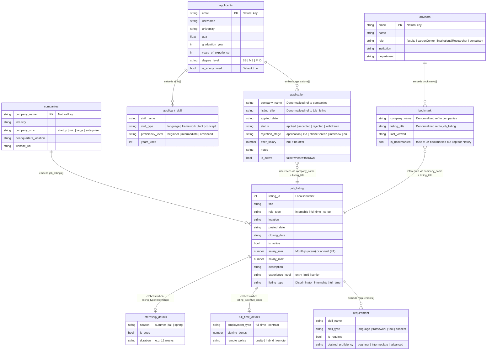

# Recruit.log -- Hierarchical Document Model (MongoDB ERD)

> This diagram shows the 3 root MongoDB collections and their embedded sub-documents.
> The original Project 1 SQL schema had 11 normalized tables; Project 2 collapses them
> into 3 denormalized collections using MongoDB's embedded document pattern.

## Mapping from SQL Tables to MongoDB Collections

| SQL Tables (Project 1)                                          | MongoDB Collection (Project 2) |
|-----------------------------------------------------------------|-------------------------------|
| Company, Job_Listing, Internship, Full_Time, Skill, Listing_Requirement | **companies**           |
| Applicant, Applicant_Skill, Skill, Application                  | **applicants**                |
| Advisor, Advisor_Bookmark                                       | **advisors**                  |

## Mermaid ERD

## Legend

| Symbol | Meaning |
|--------|---------|
| `||--o{` | One-to-many embedding (parent embeds array of children) |
| `||--o|` | One-to-zero-or-one embedding (conditional sub-document) |
| `}o--||` | Many-to-one logical reference (denormalized string, not a foreign key) |
| **Bold collection name** | Root-level MongoDB collection (top of document hierarchy) |
| Regular entity name | Embedded sub-document (lives inside a parent collection) |

## Transformation Summary

**11 SQL tables** collapsed into **3 MongoDB collections**:

- **companies** absorbs: Company + Job_Listing + Internship + Full_Time + Listing_Requirement + Skill (requirement context) = **6 tables**
- **applicants** absorbs: Applicant + Applicant_Skill + Skill (proficiency context) + Application = **4 tables**
- **advisors** absorbs: Advisor + Advisor_Bookmark = **2 tables**

> Note: The Skill entity from SQL appears in multiple embedded contexts (as `requirement` in listings and as `applicant_skill` in applicants) rather than as a shared referenced collection. This denormalization is intentional -- skills are lightweight value objects that benefit from co-location with their parent documents.
